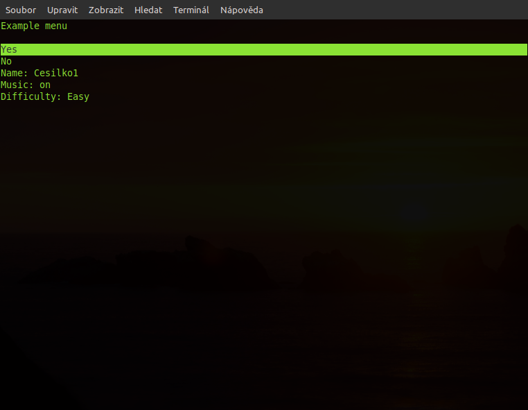

# Console menu

## Interactive console menu for C#

*v 1.3.4*

---

**note:** This software is developed and optimalised for Linux with Mono runtime. Running this software on Windows may contains bugs.



---

### example code
```csharp
using System;
using Menu;

public class main {
	public static void Main(string[] argv) {

		//create instance with menu header, set true for looped menu cursor
		ConsoleMenu menu = new ConsoleMenu("Example menu", true);


		//adding items into menu
		menu.AddItem(new Button("Yes"));   				 //item index 0
		menu.AddItem(new Button("No"));     			 //item index 1
		menu.AddItem(new Input("Name"));     			 //item index 2
		menu.AddItem(new Switcher("Music")); 			 //item index 3
		menu.AddItem(new Option("Difficulty", new string[]{"Easy", "Normal", "Hard"})); //item index 4

		//method Display() returns index of pressed button and show interactive menu in console
		int menu_id = menu.Display();

		//write id of pressed button
		Console.WriteLine(menu_id);

		//write data of menu item with index 2
		Console.WriteLine(menu.GetData()[2]);

		//write data of menu item with index 3
		Console.WriteLine(menu.GetData()[3]);

		//write data of menu item with index 4
		Console.WriteLine(menu.GetData()[4]);
	}
}
```

---

### Available menu items

* **Button()**
	* Parameters:

		* Title

	* closes the menu and returns index of item

* **Switcher()**
	* Parameters:

		* Title

		* State* _bool_

		* OnText* _string_

		* OffText* _string_

	* switches between on and off
	* return data:
		* *bool*

* **Option()**
	* Parameters:

		* Title

		* Options _string[]_

	* switches between given keywords
	* return data
		* *string*

* **Input()**
	* Parameters:

		* Title

		* InputData* _string_

	* text or number input
	* return data:
		* *string/int*


---

parameters with * is optional
